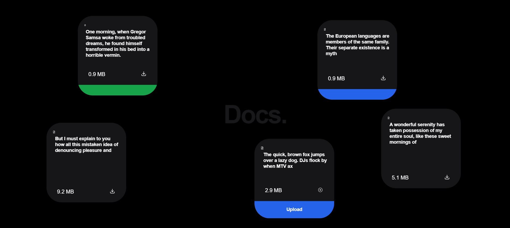

# Docs-React

Docs-React is a sleek and intuitive document management application built with React. It provides users with a seamless interface for creating, managing, and organizing documents. With its modern design and user-friendly features, Docs-React aims to enhance productivity and simplify document workflows.

## Technologies Used

Docs-React utilizes the following technologies:

- **React**: A popular JavaScript library for building user interfaces.
- **Tailwind CSS**: A utility-first CSS framework for quickly styling applications.
- **Framer Motion**: A library for creating smooth animations and interactions in React applications.

## Features

- **Draggable Functionality**: Utilizes Framer Motion to enable draggable behavior for smoother user interactions.
- **Responsive Design**: Ensures optimal viewing and functionality across various devices and screen sizes.

## Installation and Setup

To run Docs-React locally on your machine, follow these steps:

1. Clone the repository to your local machine.
2. Navigate to the project directory in your terminal.
3. Install dependencies using `npm install`.
4. Start the development server using `npm start`.
5. Open your web browser and visit `http://localhost:Port` to access the application.

## Usage

Upon launching Docs-React, you'll be greeted with a visually appealing background and the main content area where document cards are displayed. Each card represents a document and includes essential details such as description, file size, and download/upload options.

You can interact with the document cards by clicking on them or using the draggable functionality provided by Framer Motion. Additionally, the application is responsive, ensuring a seamless experience across various devices.

## Screenshots

## Author

Docs-React is created and maintained by **Vishal Pandey**.